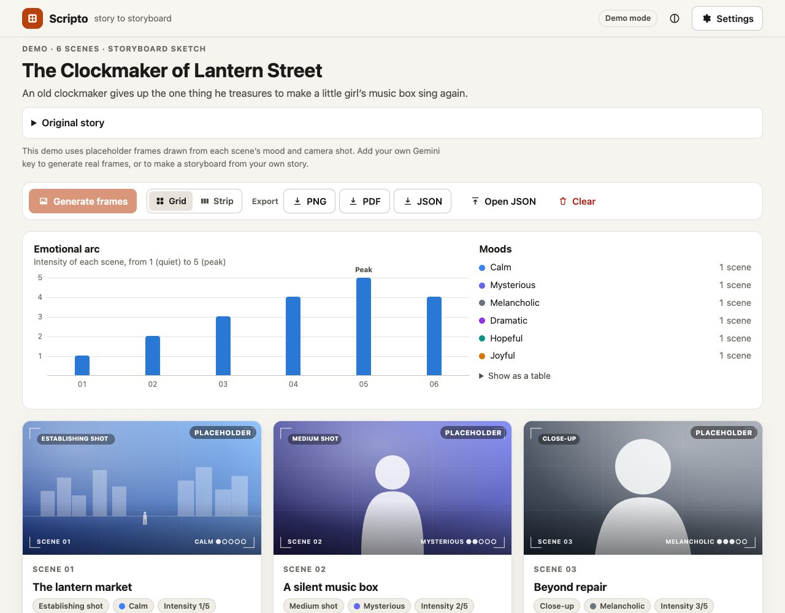
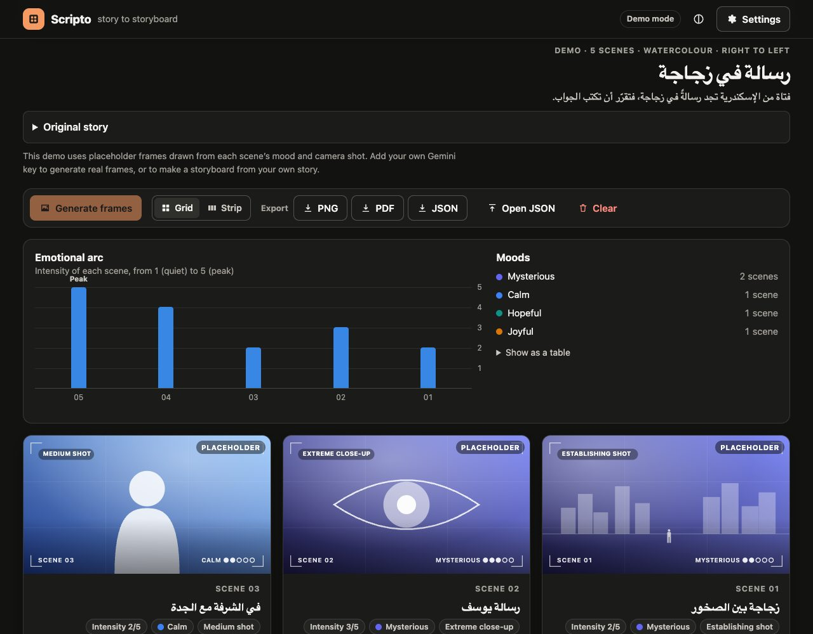

# Scripto

**Turn a story into a storyboard, in your browser.** Paste a short story or plot and Scripto splits it into scenes, each with a camera shot, a mood, the characters and setting, and a line of dialogue or narration. Then it draws a frame for every scene in one consistent visual style.

**Live demo:** https://moviconexus.me/scripto/
(open a sample directly: [English](https://moviconexus.me/scripto/?demo=clockmaker) · [Arabic, right to left](https://moviconexus.me/scripto/?demo=bottle))

Scripto is a static site with no backend. It calls Google's Gemini API straight from your browser with **your own API key**, which stays in your browser. Without a key it runs in demo mode with two sample storyboards.



## Features

- **Story → scenes.** Gemini returns the storyboard as structured JSON against a JSON Schema. Scripto validates the answer and repairs what it can: code fences, moods and shots outside the allowed lists, out-of-range values, too many scenes. Answers it cannot use get a clear error message.
- **Scene cards.** Each card has a title, a short description, the characters in frame, the setting, the mood and its intensity (1–5), the camera shot (wide, close-up, over the shoulder and so on), and a dialogue or narration line.
- **Frames with a consistent look.** One image per scene, in a style you pick (storyboard sketch, cinematic, watercolour, anime, graphic novel or noir). Every prompt repeats the same character descriptions, and the first finished frame is sent along with the rest as a style reference.
- **Placeholder frames.** When images are off, fail, or there is no key, a placeholder frame is drawn instead: a gradient for the mood plus a sketch of the camera shot. The storyboard still reads as a sequence.
- **Edit and redraw.** Edit any scene's text, shot or mood, and regenerate a single frame.
- **Emotional arc.** A small chart shows each scene's intensity, with a list of moods and a table view.
- **Export.** PNG (drawn on a canvas), PDF (through the browser's print dialog, with a print stylesheet) and JSON. JSON files can be opened again later.
- **Arabic and other right-to-left stories.** Scene text keeps the language of the story, and the storyboard switches to right-to-left layout when the story is in Arabic, Hebrew, Persian or Urdu.
- **Accessible and responsive.** Grid or horizontal strip layout, light, dark and system themes, keyboard navigation, screen reader labels, a live region for progress, and reduced-motion support.



## How it works

```
story ──► text model ─────────────► JSON ──► validate + repair ──► storyboard
          (structured output,                                         │
           JSON Schema, low thinking)                                 ▼
                                             for each scene: image prompt
                                             (style + shot + mood + cast)
                                                                      │
          image model ◄───────────────────────────────────────────────┘
          (16:9 frame, optional style reference)
                │
                ▼
          data: URL frame  ──or on failure──►  SVG placeholder frame
```

Both calls go to the Gemini **Interactions API** (`POST https://generativelanguage.googleapis.com/v1beta/interactions`), which Google's docs recommend for new projects. Every request sends `store: false`, so Google does not keep the interaction for later retrieval. The key goes in the `x-goog-api-key` header, never in the URL.

| Module | Role |
| --- | --- |
| `src/lib/prompts.ts`, `src/lib/schema.ts` | System instruction, story input, JSON Schema and image prompts |
| `src/lib/gemini.ts`, `src/lib/errors.ts` | `fetch` client, timeouts, one retry on 5xx, mapping API errors to plain-language messages |
| `src/lib/validate.ts` | Parses and repairs the model's JSON |
| `src/lib/generate.ts` | Story → storyboard, then frames (style reference, limited concurrency, stops early on quota or key errors) |
| `src/lib/placeholder.ts` | SVG placeholder frames |
| `src/lib/files.ts`, `src/lib/persist.ts`, `src/lib/exportImage.ts` | JSON import/export, localStorage, PNG export |
| `src/lib/settings.ts` | Settings and key storage |
| `src/demo/samples.ts` | The two demo storyboards |
| `src/components/`, `src/App.tsx` | React UI |

Stack: Vite, React and TypeScript (strict). The only runtime dependencies are React and React DOM.

## Quick start

Requires Node.js 22.12 or newer.

```sh
npm ci
npm run dev        # http://localhost:5173/scripto/
```

Open **Settings**, paste a Gemini API key from [Google AI Studio](https://aistudio.google.com/apikey), and make a storyboard. Or open a demo first, no key needed.

```sh
npm run build      # type-check and build to dist/
npm run preview    # serve the production build (with its Content-Security-Policy)
npm run check      # lint, typecheck, test and build in one go
```

## Configuration

Everything is set in the in-app **Settings** dialog and saved in `localStorage`. There are no environment variables and no `.env` file.

| Setting | Default | Notes |
| --- | --- | --- |
| Text model | `gemini-3.8-flash` | Writes the scenes. Stable, available on the free tier. Any model ID that supports structured output works. |
| Thinking level | `low` | Sent as `generation_config.thinking_level`. `gemini-3.8-flash` accepts low, medium and high; the Flash-Lite models also accept minimal. "Model default" omits it. |
| Generate images | off | Gemini image models need a **paid-tier** key, so this starts off and frames are drawn as placeholders. Turn it on with a paid key. |
| Image model | `gemini-3.1-flash-image` | Also offered: `gemini-3.1-flash-lite-image` (cheapest, 1K only) and `gemini-3-pro-image` (highest quality). |
| Image size | `1K` | `2K` is sharper and costs more. The Lite model always uses 1K. |
| Style reference | on | Attaches the first finished frame to later image requests to keep the look consistent. |

The default model IDs were checked in October 2026 against Google's [models](https://ai.google.dev/gemini-api/docs/models), [thinking](https://ai.google.dev/gemini-api/docs/thinking), [structured output](https://ai.google.dev/gemini-api/docs/structured-output), [image generation](https://ai.google.dev/gemini-api/docs/image-generation) and [pricing](https://ai.google.dev/gemini-api/docs/pricing) pages. Models change often. If one is retired, choose another in Settings. No code change is needed.

The site is built for `https://moviconexus.me/scripto/`, so Vite's `base` is `/scripto/` (see `vite.config.ts`).

## Your API key and privacy

- The key is stored **only in this browser's localStorage**, under its own entry. **Forget key** in Settings removes it.
- It is sent **only to `generativelanguage.googleapis.com`**, and only when you generate something. It is never logged: ESLint forbids `console` in the codebase, and error messages are scrubbed of anything that looks like a key.
- A strict **Content-Security-Policy** in the built page allows scripts, styles and fonts from the site itself, and network requests only to the site and Google's API. There are no analytics, cookies or third-party scripts.
- **What Google receives:** your story (for scenes), each scene's description and prompt (for frames), and your key. Requests use `store: false`. Google's terms still apply: on the free tier, Google may use prompts and responses to improve its products.
- Good practice: use a dedicated key restricted to the Gemini API, set a budget alert in Google Cloud, and click **Forget key** when you are done on a shared computer.

## Tests

```sh
npm test
```

Vitest and React Testing Library run in jsdom, with `fetch` mocked. No test calls the real API. The tests cover:

- prompt, schema and request building (including `store: false`, the thinking level and the image format)
- response validation and repair, and malformed-output handling
- the API client: header-only key, error mapping for 400/403/404/429/5xx, retry, timeout, cancellation, incomplete or blocked interactions, and key redaction
- generation of storyboards and frames (style reference, early stop on fatal errors)
- settings and key storage (including blocked storage), JSON import/export, local persistence
- demo mode, right-to-left detection, placeholders, the PNG layout helpers, the chart and the main UI flows

GitHub Actions runs lint, typecheck, tests and the build on every push and pull request (`.github/workflows/ci.yml`).

## Deploying to GitHub Pages

`.github/workflows/deploy.yml` builds the site and publishes `dist/` with `actions/upload-pages-artifact` and `actions/deploy-pages` on every push to `main`. Before the first deploy, enable Pages in the repository settings: **Settings → Pages → Build and deployment → Source: GitHub Actions**.

## Limitations

- **Bring your own key, in the browser.** Google's key guidance says not to build API keys into client-side code and suggests a backend proxy for production apps. Scripto never ships a key. Each person pastes their own, and it stays in their own browser, so there is no server holding secrets. The trade-off: anything with access to your browser profile (for example a malicious extension) could read the key from localStorage.
- **Frames cost money.** Image generation is not available on Gemini's free tier. At Google's October 2026 list prices a frame costs roughly US$0.03 to US$0.13, depending on the model and size. With a free-tier key, turn images off and use the placeholders.
- **Consistency is approximate.** Shared character descriptions and a style reference help a lot, but faces, clothes and props can still drift between frames.
- **The model can get things wrong.** It may miscount scenes, pick an odd shot, or be stopped by Google's safety filters. Scripto reports these cases and lets you edit or regenerate, but it cannot guarantee a good result.
- **Frames may not survive a reload.** Generated images are kept in localStorage when they fit. Large storyboards can exceed the browser's quota, in which case Scripto saves the text only and tells you. Export JSON to keep the frames.
- **Short stories only.** Up to 12,000 characters and 3–10 scenes. There is no streaming, so long generations simply take a while (they can be cancelled).
- **The API is v1beta.** The Interactions API lives under `/v1beta/`, and request or response details may change.
- **English interface.** Stories and scene text can be in any language, but buttons and labels are in English.
- **PNG export draws on a canvas.** If a browser refuses to export it, use PDF instead.

## License

[MIT](LICENSE) © 2026 Aya Nabil
